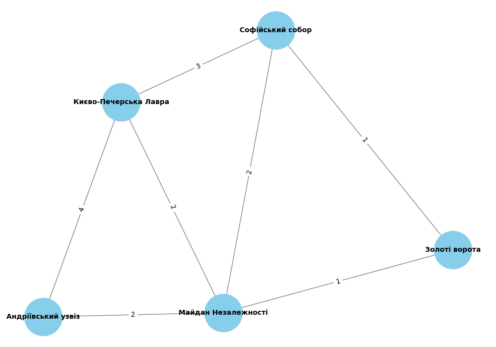

# Порівняння алгоритмів DFS та BFS для знаходження шляхів у графі

## Опис
Цей документ містить порівняння алгоритмів DFS (глибини пошуку) та BFS (ширини пошуку) для знаходження шляхів у графі, що моделює транспортну мережу туристичних місць Києва.

## Граф
Мережа включає такі туристичні місця:
1. Києво-Печерська Лавра
2. Софійський собор
3. Золоті ворота
4. Майдан Незалежності
5. Андріївський узвіз

Графічне представлення мережі:

## Результати пошуку

### Шлях від "Києво-Печерська Лавра" до "Андріївський узвіз"

#### DFS (глибини пошуку)
- Шлях: ['Києво-Печерська Лавра', 'Софійський собор', 'Золоті ворота', 'Майдан Незалежності', 'Андріївський узвіз']

#### BFS (ширини пошуку)
- Шлях: ['Києво-Печерська Лавра', 'Андріївський узвіз']

## Пояснення результатів
DFS (глибини пошуку) йде по глибоких шляхах до тих пір, поки не досягне цілі або не повернеться назад. Це означає, що DFS може знайти шлях, який не є найкоротшим, особливо якщо в графі є кілька шляхів до цілі.

BFS (ширини пошуку) йде по всіх сусідніх вершинах, перш ніж перейти на наступний рівень глибини, тому знаходить найкоротший шлях у графі.

## Висновки
- **DFS** може знайти будь-який шлях до цілі, але не завжди найкоротший.
- **BFS** завжди знаходить найкоротший шлях, якщо всі ребра мають однакову вагу.

На основі отриманих результатів, алгоритм BFS краще підходить для знаходження найкоротшого шляху в графах з рівними вагами ребер.
